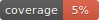

# fake-vcf

<div align="center">

[](https://github.com/endast/fake-vcf/actions?query=workflow%3Abuild)
[](https://pypi.org/project/fake-vcf/)
[](https://github.com/endast/fake-vcf/pulls?utf8=%E2%9C%93&q=is%3Apr%20author%3Aapp%2Fdependabot)

[](https://github.com/psf/black)
[](https://github.com/PyCQA/bandit)
[](https://github.com/endast/fake-vcf/blob/main/.pre-commit-config.yaml)
[](https://github.com/endast/fake-vcf/releases)
[](https://github.com/endast/fake-vcf/blob/main/LICENSE)


## A fake vcf file generator

</div>

fake-vcf generates fake [vcf files](https://en.wikipedia.org/wiki/Variant_Call_Format)

## Usage

### Setup

```shell
git clone https://github.com/endast/fake-vcf.git
cd fake-vcf
make poetry-download
make install
```

### Run

By default `fake-vcf` writes to stdout

```shell
poetry run fake-vcf -s 2 -r 2
##fileformat=VCFv4.2
##source=VCFake 0.1.0
##FILTER=<ID=PASS,Description="All filters passed">
##INFO=<ID=NS,Number=1,Type=Integer,Description="Number of Samples With Data">
##contig=<ID=chr1>
##reference=ftp://ftp.example.com/sample.fa
##INFO=<ID=AF,Number=A,Type=Float,Description="Estimated allele frequency in the range (0,1)">
##INFO=<ID=DP,Number=1,Type=Integer,Description="Approximate read depth; some reads may have been filtered">
##FORMAT=<ID=GT,Number=1,Type=String,Description="Phased Genotype">
#CHROM	POS	ID	REF	ALT	QUAL	FILTER	INFO	FORMAT	S0000001	S0000002
chr1	63	rs143	C	A	96	PASS	DP=10;AF=0.5;NS=2	GT	0|0	0|0
chr1	71	rs31	A	T	37	PASS	DP=10;AF=0.5;NS=2	GT	0|0	0|0

```

You can write to a vcf file by piping the output to a file:

```shell
poetry run fake-vcf -s 2 -r 2 > fake_file.vcf
ls -lah
total 1
-rw-r--r--   1 magnus  staff   682B Jul 28 16:48 fake_file.vcf
```

Or let the script write to a file directly using `-o`:

```shell
poetry run fake-vcf -s 2 -r 2 -o fake_file.vcf

Writing to file fake_file.vcf
(No compression)
100%|████████████████████████████████████████████████████████████████████████████████████████████████████████████████████| 3/3 [00:00<00:00, 50942.96it/s]
Done, data written to fake_file.vcf
ls -lah
total 1
-rw-r--r--   1 magnus  staff   682B Jul 28 16:48 fake_file.vcf
```

And if you want the file gzipped add .gz to the file name:

```shell
poetry run fake-vcf -s 2 -r 2 -o fake_file.vcf.gz

Writing to file fake_file.vcf
(No compression)
100%|████████████████████████████████████████████████████████████████████████████████████████████████████████████████████| 3/3 [00:00<00:00, 50942.96it/s]
Done, data written to fake_file.vcf
ls -lah
total 2
-rw-r--r--   1 magnus  staff   682B Jul 28 16:56 fake_file.vcf
-rw-r--r--   1 magnus  staff   436B Jul 28 16:57 fake_file.vcf.gz
```


To see all options use --help

```shell
poetry run fake-vcf --help                   
                                                                                                                                                                                                                                                                                                                      
 Usage: fake-vcf [OPTIONS]                                                                                                                                                                                                                                                                                            
                                                                                                                                                                                                                                                                                                                      
╭─ Options ──────────────────────────────────────────────────────────────────────────────────────────────────────────────────────────────────────────────────────────────────────────────────────────────────────────────────────────────────────────────────────────────────────────────────────────────────────────╮
│ --fake_vcf_path  -o                 PATH     Path to fake vcf file. If the path ends with .gz the file will be gzipped. [default: None]                                                                                                                                                                            │
│ --num_rows       -r                 INTEGER  Nr rows to generate (variants) [default: 10]                                                                                                                                                                                                                          │
│ --num_samples    -s                 INTEGER  Nr of num_samples to generate. [default: 10]                                                                                                                                                                                                                          │
│ --chromosome     -c                 TEXT     chromosome default chr1 [default: chr1]                                                                                                                                                                                                                               │
│ --seed                              INTEGER  Random seed to use [default: 42]                                                                                                                                                                                                                                      │
│ --sample_prefix  -p                 TEXT     Sample prefix ex: SAM =>  SAM0000001    SAM0000002 [default: S]                                                                                                                                                                                                       │
│ --phased             --no-phased             Simulate phased [default: phased]                                                                                                                                                                                                                                     │
│ --version        -v                          Prints the version of the fake-vcf package.                                                                                                                                                                                                                           │
│ --help                                       Show this message and exit.                                                                                                                                                                                                                                           │
╰────────────────────────────────────────────────────────────────────────────────────────────────────────────────────────────────────────────────────────────────────────────────────────────────────────────────────────────────────────────────────────────────────────────────────────────────────────────────────╯
```

## 📈 Releases

You can see the list of available releases on the [GitHub Releases](https://github.com/endast/fake-vcf/releases) page.

We follow [Semantic Versions](https://semver.org/) specification.

We use [`Release Drafter`](https://github.com/marketplace/actions/release-drafter). As pull requests are merged, a draft
release is kept up-to-date listing the changes, ready to publish when you’re ready. With the categories option, you can
categorize pull requests in release notes using labels.

### List of labels and corresponding titles

|               **Label**               |  **Title in Releases**  |
|:-------------------------------------:|:-----------------------:|
|       `enhancement`, `feature`        |       🚀 Features       |
| `bug`, `refactoring`, `bugfix`, `fix` | 🔧 Fixes & Refactoring  |
|       `build`, `ci`, `testing`        | 📦 Build System & CI/CD |
|              `breaking`               |   💥 Breaking Changes   |
|            `documentation`            |    📝 Documentation     |
|            `dependencies`             | ⬆️ Dependencies updates |

You can update it
in [`release-drafter.yml`](https://github.com/endast/fake-vcf/blob/main/.github/release-drafter.yml).

GitHub creates the `bug`, `enhancement`, and `documentation` labels for you. Dependabot creates the `dependencies`
label. Create the remaining labels on the Issues tab of your GitHub repository, when you need them.

## 🛡 License

[](https://github.com/endast/fake-vcf/blob/main/LICENSE)

This project is licensed under the terms of the `MIT` license.
See [LICENSE](https://github.com/endast/fake-vcf/blob/main/LICENSE) for more details.

## 📃 Citation

```bibtex
@misc{fake-vcf,
  author = {Magnus Wahlberg},
  title = { A fake vcf file generator },
  year = {2023},
  publisher = {GitHub},
  journal = {GitHub repository},
  howpublished = {\url{https://github.com/endast/fake-vcf}}
}
```

## Credits [](https://github.com/TezRomacH/python-package-template)

This project was generated with [`python-package-template`](https://github.com/TezRomacH/python-package-template)
